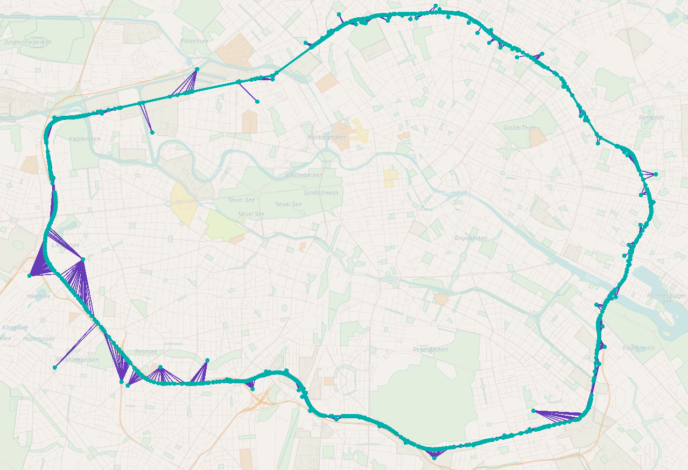
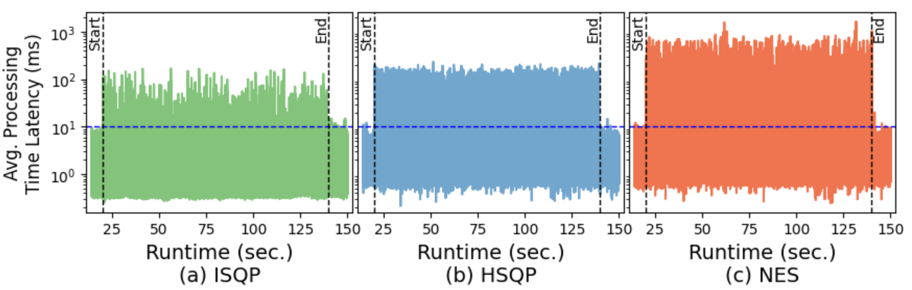

# TopologyChangeGenerator
This repository contains code to produce a collection of topology changes based on [OpenCelliD](https://opencellid.org/) database and GTFS schedule of [VBB](https://www.vbb.de/vbb-services/api-open-data/datensaetze/). This generator is used for investigating the effect of mobile infrastructure on the runtime perfromance of NebulaStream. We have a publication under submission. In the future, we will add the link to the accepted version of the paper. 

# About

This tool allows the user to generate a collection of topology change events that can be consumed by NebulaStream. To this end, the user has to select an OpenCelliD dataset for a predefined geograpical area and a public transport schedule infromation provided by Gtfs file. The user then selects a predefined time interval for which the schedule needs to be picked. 
This information is used to (1) the number buses/trams/trains/subways represented as mobile devices, (2) identify the bus/train/tram/subway lines that the mobile devices operate on, and (3) the number of trips the mobile devies perfroms during the selected schedule time frame. Next, user selects the cell towers that need to be considered for computing the fixed base stations to which the mobile devices disconnect and reconnect when they move around the geographical area while performing the trips. 
The user can also define speedups using "batchIntervalSizeInSeconds" ([see](#parameters-for-schedule-selection)) setting to condense a large schedule time into a very small interval to generate large number of topology change events per second. This approach is similar to the one used by Huan et al. in [Efficient and Error-bounded Spatiotemporal Quantile Monitoring in Edge Computing
Environments](https://vbn.aau.dk/ws/portalfiles/portal/515412211/p1753_li.pdf).

# Experiments

We use the data generated by the tool to evaluate the time it takes for NebulaStream to reconfigure the running plans consuming data from mobile devices (trains).

## The case of Ring-Bahn

We use the topology change generator to produce trajectory of Berlin S41 and S42 line that runs on a circular track in opposite directions. 
We couple this trajectory information together with the cell tower data from OpenCelliD database. 
The trains then works as the mobile devices and cell tower s the edge nodes that provide compute resources outside the cloud datacenter. 
The below image shows the train trajectory with green line and cell towers with green dots along the line:



We select the schedule for 20 minutes for S41 and S42 on a weekday (Monday). 
This results in overall 24 trains serving the passengers.
We then condense the 20-minute schedule to perform a two-minute emulation to increase the number of activities in the train network. 
Please note that in the real world, we expect many reconnects due to more lines without the need to compress the schedule.
During the emulation, the trains carry passengers from one station to another.
As they move along the track, they disconnect from a cell tower and reconnect to the neighboring one.
In our emulation, 90 cell towers were along the train track, and on average, six trains were disconnected and reconnected per second.
This results in frequent interruptions of running queries as the downstream operators, who consume data from the moving train, stop receiving data.
Therefore, DSPE needs to perform re-operator placement based on where the data sources (trains) reconnect after disconnection.
We deployed 60 queries, which DSPE merged into ten shared query plans after performing multi-query optimization.
Each of the ten queries consumes data from 4 trains that follow each other on the circular track.
NebulaStream uses a greedy but fast operator re-placement strategy called _incremental stream query placement_ (**ISQP**) to reduce the interruption time.
The strategy identifies the increment of operators needing re-placement and concurrently processes the affected operator increments.
Afterward, NebulaStream combines fine-grained reconfiguration protocol and buffering at the upstream nodes to quickly resume the interrupted queries.
To show the effect of different strategies, we report the overall processing latency of running queries as trains move on the track.
To conduct this experiment, we deployed 60 queries.
Here, **NES** is the state-of-the-art strategy of completely un-deploying the affected queries, serially performing holistic re-placement, and re-deployment of all un-deployed queries based on the latest topology state.
**HSQP** is our improved baseline, where we perform holistic re-placement and re-deployment like for __NES__. 
However, all affected queries are processed concurrently. 



# Pre-Processing Steps

1. Download the GTFS schedule from VBB link provided above. The schedule information is used for finding the trajectory of mobile devices.
2. Create a SQLite database from the gtfs schedule using the tool [gtfsdb tool](https://github.com/OpenTransitTools/gtfsdb) using the bellow commands and place the database at the root of the project.
```  
   pip install zc.buildout
   git clone https://github.com/OpenTransitTools/gtfsdb.git
   cd gtfsdb/
   buildout install prod
   bin/gtfsdb-load --database_url sqlite:///vbb_gtfs.db <location of gtfs file>/GTFS.zip
```   
3. Install Rust toolchain (`curl --proto '=https' --tlsv1.3 https://sh.rustup.rs -sSf | sh` for ubuntu 22.04 LTS).

# Execution

Run the command to build the project `cargo build --release`.

Run the following command to generate topology changes with default configurations `target\release\cmad_tool`.

Run the following command to know all command line options `target\release\cmad_tool --help`.

# Parameters

### Gtfs Database parameters

```yaml
db_path: Path to the gtfs database
```

### Parameters for schedule selection

```yaml
start_time                    : The time of the day from when the schedule needs to be selected  
end_time                      : The time of the day until when the schedule needs to be selected
day_of_the_week               : The day of the week (in number) for which the schedule needs to be selected. The week starts with 0 for Sunday and ends at 6 for Saturday.
line_name                     : Name of the train line 
batch_interval_size_in_seconds: The time interval in seconds to be represented by a single batch. This parameter allows us to speedup the time to increase the rate of topology changes.
batch_frequency_in_seconds    : The frequency at which the batch of topology changes needs to be produced.
```

### Parameters to store output files

```yaml
topology_path: Path to the file where fixed_topology.json will be produced
topology_updates_path: Path to the file where topology_updates.json will be produced
geo_json_path: Path to the file where geo.json will be produced
```

### Parameters for selecting the base stations

```yaml
file_path: Name of the csv file containing OpenCelliD data.
min_samples: The minimum number of measurements required for a cellular base station to be included in the experiment.
radio: The type of network the base station supports. We use LTE only for our experiments.
```

## Output Files

**geo.json**: This file that can be used to plot on a map the whole experiment setup.

**fixed_topology.json**: This file contains the geographical location of the mobile towers. This information is used to decide the connection point of the mobile node.

Example output:

```json
{
  "nodes": {
    "<node_id>": [
      lat,
      lon
    ],
    ...
  },
  "slots": {
    "<node_id>": <num_of_slots>,
    ...
  },
  "children": {
    "<node_id>": [],
    ...
  }
}

```

**topology_updates.json**: This file contains the topology changes generated by the tool. NebulaStream consumes these changes to mimic the disconnection and reconnection of topology nodes. 

Example output:

```json
{
"initial_parents": [
    [
    <source_node_id>,
    <parent_node_id>
    ],
    ...
],
"topology_updates": [
{
    "timestamp": <time_when_the_change_is_to_be_triggered>,
    "events": [
        {
        "parentId": <old_parent_node_id>,
        "childId": <mobile_node_id>,
        "action": "remove"
        },
        {
        "parentId": <new_parent_node_id>,
        "childId": <mobile_node_id>,
        "action": "add"
        }
      ]
},
    ...
]
}
```

## Acknowledgement
The OpenCelliD database file in the project is downloaded from https://opencellid.org under Creative Commons License. OpenCelliD Project is licensed under a Creative Commons Attribution-ShareAlike 4.0 International License
